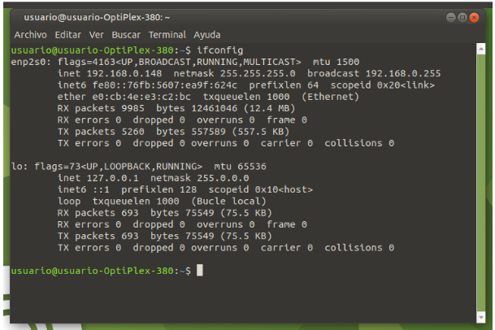
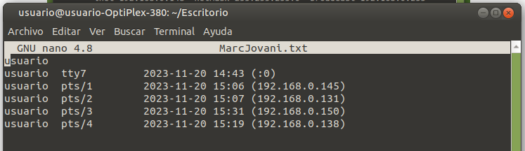

# Examen DAW
### Segundo ejercicio
Documenta todos los pasos realizados en un archivo MarkDown. Accede a esta máquina remota mediante ssh:


Deberás ir al escritorio y crear un archivo de texto que contenga como nombre de archivo, tu nombre propio y apellido sin espacios y con extensión txt (por ejemplo ArnoldSchwarzenegger.txt) escribe en su interior el resultado de whoami.

Después, mediante otro comando, concatena al final del archivo el resultado del comando necesario para saber quién está conectado a la máquina mediante ssh.
#### Solución
```ssh -p 22 usuario@192.168.0.148```
Seguidamente, escribimos "yes" y pulsamos "intro".
Una vez conectados, nos ubicamos en el escritorio y creamos el archivo de nombre "MarcJovani.txt" y concatenamos el resultado del comando "whoami":
```
cd Escritorio
touch MarcJovani.txt
whoami >> MarcJovani.txt
```


Ahora concatenamos al final del archivo el resultado del comando "who"
```who >> MarcJovani.txt```

