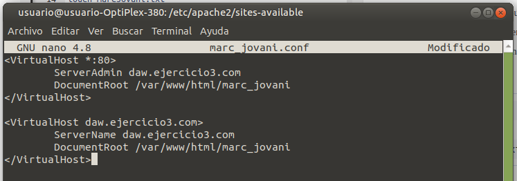
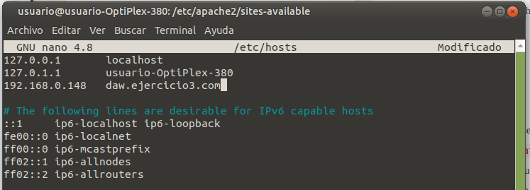
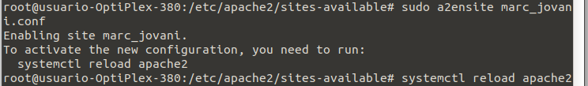
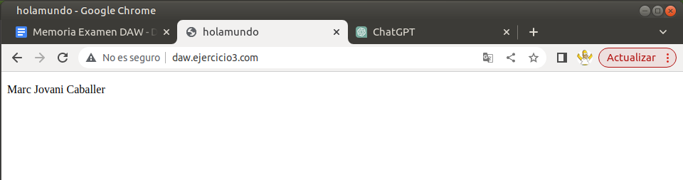

### Tercer ejercicio
Primero comprobamos que apache se esté ejecutando con el comando:
```sudo service apache2 status```
Seguidamente pasamos a crear un nuevo VirtualHost accediendo a la carpeta "sites-available" y creando un nuevo archivo ".conf" a partir del por defecto:
```
cd /etc/apache2/sites-available/
sudo cp 000-default.conf marc_jovani.conf
sudo nano marc_jovani.conf
```


Ahora modificamos el archivo hosts:
```sudo nano /etc/hosts```


En este momento trasladamos el archivo que acabamos de crear a la ruta: /var/www/marc_jovani:
```sudo mv /home/usuario/Escritorio/index.html /var/www/marc_jovani```
y lo habilitamos en línea de comandos:


Una vez hecho esto probamos en el navegador que el host funciona:

